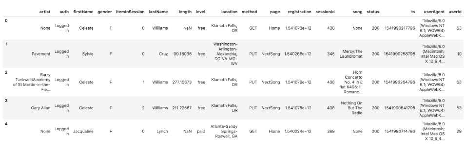
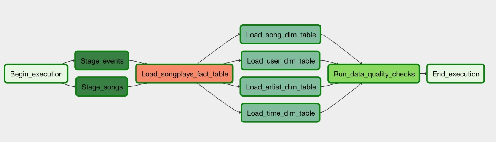
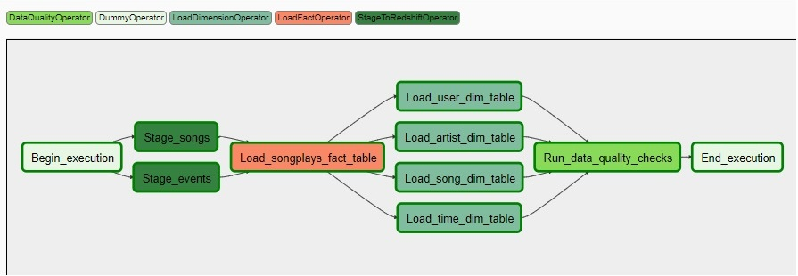
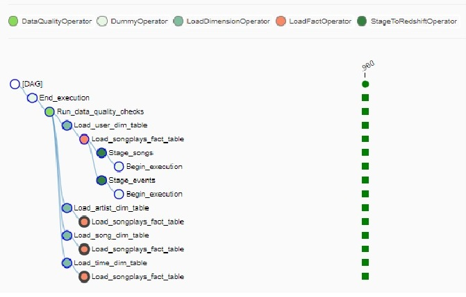
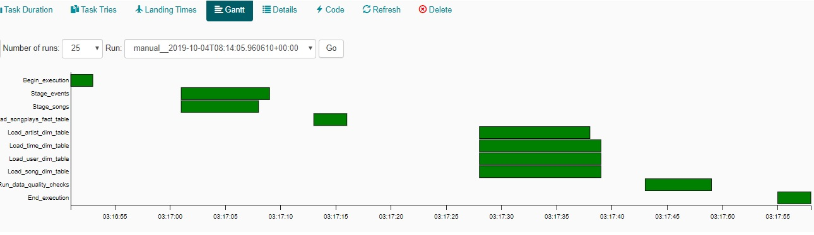

## Project Name
Create Data pipeline using Apache Airflow which is dynamic and built from reusable tasks, can be monitored, and allow easy backfills for a music streaming startup **Sparkify** to perform Song Play Analysis.

## Project Description & Purpose
A startup called Sparkify wants to analyze the data they've been collecting on songs and user activity on their new music streaming app. The analytics team is particularly interested in understanding what songs users are listening to. Currently, they don't have an easy way to query their data, which resides in a directory of JSON logs on user activity on the app, as well as a directory with JSON metadata on the songs in their app.

The purpose of this project is to create high grade data pipelines that are dynamic and built from reusable tasks, can be monitored, and allow easy backfills. Data quality plays a big part when analyses are executed on top the data warehouse and want to run tests against the datasets after the ETL steps have been executed to catch any discrepancies in the datasets.

The source data resides in S3 and needs to be processed in Sparkify's data warehouse in Amazon Redshift. The source datasets consist of JSON logs that tell about user activity in the application and JSON metadata about the songs the users listen to.

## Cloud Architecture

In this project, the source JSON datasets, Intermediate Staging layer and the final Datawarehouse - All these 3 entities exists in cloud.

This project's architecture is implemented in Amazon Web Services (AWS) Cloud platform and the data pipeline is orchestrated using Apache Airflow.

The various Cloud components involved or required in this project are as follows:
* **Apache Airflow** (Data Pipeline)
  * Airflow is a platform to programmatically author, schedule and monitor workflows.

  * Airflow is used to author workflows as directed acyclic graphs (DAGs) of tasks. The airflow scheduler executes the tasks on an array of workers while following the specified dependencies. Rich command line utilities make performing complex surgeries on DAGs a snap. The rich user interface makes it easy to visualize pipelines running in production, monitor progress, and troubleshoot issues when needed.

* **Amazon S3** (Storage Layer)
  * Amazon Simple Storage Service (Amazon S3) is an object storage service that offers industry-leading scalability, data availability, security, and performance.
  
  
* **Redshift** (Data Warehouse)
  * An Amazon Redshift data warehouse is a collection of computing resources called nodes, which are organized into a group called a cluster. 
  * Each cluster runs an Amazon Redshift engine and contains one or more databases.

## Source(s)

In this project, the data is extracted from 2 set of files which are of JSON file format located in a public S3 bucket "udacity-dend".
The S3 links for the datasets are as follows:

* Song data: 
  * *s3://udacity-dend/song_data*  (<https://s3.console.aws.amazon.com/s3/buckets/udacity-dend/log-data/?region=ca-central-1>)
* Log data: 
  * *s3://udacity-dend/log_data* (<https://s3.console.aws.amazon.com/s3/buckets/udacity-dend/song-data/?region=ca-central-1&tab=overview>)
* Log data json path: 
  * *s3://udacity-dend/log_json_path.json* (<https://s3.console.aws.amazon.com/s3/object/udacity-dend/log_json_path.json?region=ca-central-1&tab=overview>)

#### Song Dataset
The first dataset is a subset of real data from the Million Song Dataset. Each file is in JSON format and contains metadata about a song and the artist of that song. The files are partitioned by the first three letters of each song's track ID. For example, here are filepaths to two files in this dataset.

`song_data/A/B/C/TRABCEI128F424C983.json`
`song_data/A/A/B/TRAABJL12903CDCF1A.json`

And below is an example of what a single song file, TRAABJL12903CDCF1A.json, looks like.

`{"num_songs": 1, "artist_id": "ARJIE2Y1187B994AB7", "artist_latitude": null, "artist_longitude": null, "artist_location": "", "artist_name": "Line Renaud", "song_id": "SOUPIRU12A6D4FA1E1", "title": "Der Kleine Dompfaff", "duration": 152.92036, "year": 0}`
  

#### Log Dataset
The second dataset consists of log files in JSON format which has the Song play activity logs from a music streaming app based on specified configurations.

The log files are partitioned by year and month. For example, here are filepaths to two files in this dataset.

`log_data/2018/11/2018-11-12-events.json`
`log_data/2018/11/2018-11-13-events.json`

And below is an example of what the data in a log file, 2018-11-12-events.json, looks like.

## Staging
The data extracted from Source JSON files are loaded into a set of Staging tables in Redshift database, named as `dwh`.
This includes the following tables.

#### Staging Tables
1. **staging_events** - records in log data associated with song plays i.e. records with page NextSong
    *     artist, auth, firstName, gender, itemInSession, lastName, length, level, location, method, page, registration, sessionId, song, status, ts, userAgent, userId
    
2. **staging_songs** - 
    *     num_songs, artist_id, artist_latitude, artist_longitude, artist_location, artist_name, song_id, title, duration, year 

## Target(s)
The data from Staging tables are loaded into a new Redshift datawarehouse which is modeled based on star schema design. This includes the following tables.

#### Fact Table
1. **songplays** - records in log data associated with song plays i.e. records with page NextSong
    * songplay_id, start_time, user_id, level, song_id, artist_id, session_id, location, user_agent
    
#### Dimension Tables
2. **users** - users in the app
    * user_id, first_name, last_name, gender, level
3. **songs** - songs in music database
    * song_id, title, artist_id, year, duration
4. **artists** - artists in music database
    * artist_id, name, location, lattitude, longitude
5. **time** - timestamps of records in songplays broken down into specific units
    * start_time, hour, day, week, month, year, weekday

### Database Schema Diagram
Following is the Schema Diagram for **sparkify** database.

#### ETL - Extract Step
Data is extracted from 2 set of files located in AWS S3 buckets which are of JSON file format. 
* songs data
* log data

Data is extracted using COPY command to facilitate faster retrieval and loaded into Staging tables.
S3 Bucket name, Target Table name, AWS Access Key ID, Secret Access Key are passed as parameters.

<pre  style="color:blue">
        COPY {}
        FROM '{}'
        ACCESS_KEY_ID '{}'
        SECRET_ACCESS_KEY '{}'
        JSON '{}'
</pre>

#### ETL - Transform & Load Step

##### Users Dimension Load
Distinct users are extracted from staging_events table and loaded in Users dimension.
There will be duplicate records for users from source due to the nature where a "free" user would have changed to "paid" user later.
So there can be atleast 2 records for same user id with "level" value as "free" & "paid".
To handle that scenario, the values are grouped based on userId, firstName, lastName and gender and a maximum value of "level" is taken.

Since the Users dimension is relatively small, it is distributed using Distribution style "all". This wil broadcast the table into all clustes which allows faster joining with fact table.

##### Songs Dimension Load
Distinct songs are extracted from staging_songs table. This table is already unique based on Song ID.

Since the Songs dimension is relatively large, it is distributed using Distribution Key "Song_id".

##### Artists Dimension Load
Distinct Artists are extracted from staging_songs table. 
In some sceanrios, we can find duplicate records for Artist ID which has different Artist names.
To handle that, the Artist data is partitioned by Artist ID and the records with latest year is pciked up.

This dimension table is distributed using Distribution style even.

##### Time Dimension Load
This dimension table is distributed using Distribution style even.

The timestamp for each song play (Start time) is coming from source as milliseconds format. This needs to be transformed into proper datetime format before loading into Time dimension. Also, the following time related fields are derived from the timestamp and stored into Time dimension.

* start_time (Timestamp after converting from milliseconds to datetime format)
* hour
* day
* week
* month 
* year
* weekday

##### Songplays Fact Load
Data from staging_events are loaded into the facts by joining with other dimension tables to get the Dimension keys.

User_id is used to join Users dimension and Start_time is used to join Time dimension.

The events/log data does not specify an ID for either the song or the artist. So in order to relate the corresponding song ID and artist ID for each songplay, a combination of song title, artist name, and song duration time are used. 

The query used for Songs/Artists dimension lookup to assign song ID and artist ID is as follows:

##### Dimension Lookup Query:
<pre  style="color:blue">
select s.song_id, a.artist_id 
    from songs s  
    inner join artists a  
    on s.artist_id = a.artist_id
    where s.title = %s 
    and a.name = %s
    and s.duration = %s
</pre>

## Data Pipepine using Airflow

### Setup Airflow Connections
Add Airflow Connections
Here, we'll use Airflow's UI to configure your AWS credentials and connection to Redshift.
1. Go to the Airflow UI: - http://localhost:8080 
2. Click on the Admin tab and select Connections.
3. Under Connections, select Create.
4. On the create connection page, enter the following values:
  * Conn Id: Enter aws_credentials.
  * Conn Type: Enter Amazon Web Services.
  * Login: Enter your Access key ID from the IAM User credentials you downloaded earlier.
  * Password: Enter your Secret access key from the IAM User credentials you downloaded earlier.
  
Once you've entered these values, select Save and Add Another.

4. On the next create connection page, enter the following values:
  * Conn Id: Enter redshift.
  * Conn Type: Enter Postgres.
  * Host: Enter the endpoint of your Redshift cluster, excluding the port at the end. You can find this by selecting your cluster in the Clusters page of the Amazon Redshift console. See where this is located in the screenshot below. IMPORTANT: Make sure to NOT include the port at the end of the Redshift endpoint string.
  * Schema: Enter dev. This is the Redshift database you want to connect to.
  * Login: Enter awsuser.
  * Password: Enter the password you created when launching your Redshift cluster.
  * Port: Enter 5439.
  
Once you've entered these values, select Save.

**WARNING**: *Remember to DELETE your cluster each time you are finished working to avoid large, unexpected costs.*

### Source Code
The main source code for  is kept under 
* `/airflow/dags` - Source code for Airflow DAG
* `/airflow/plugins` - All plugins, Operators 
* `/airflow/plugins/operators` - All custom operators used in this project resides here
* `/airflow/plugins/helpers` - All helper code such as SQL queries are kept here

#### Custom Operators
There are 4 Custom Operartors used in this project

* `stage_redshift.py`
  * Loads data from given s3 bucket/key to Staging tables in AWS Redshift.
  * AWS credentials and Table name are passed as parameters
  
  
* `load_dimension.py`
  * Loads Dimension tables. 
  * Table name is passed as parameter
  * Table is truncated before every run and data will be inserted. 
  
  
* `load_fact.py`
  * Loads Fact table. 
  * Table name is passed as parameter 
  * Data will be loaded in APPEND mode.
  
  
* `data_quality.py`
  * Checks Data quality using various rules. 
  * Table name, SQL statements are passed as parameers. 
  * SQL statements passed to this operator is a list of dictionaries where each dictionary element contains the key/value for Test case name, SQL Query and Expected result as Keys. The operator will run the query and compares the actual result with the expected result. If the result does not match, throws error and raises exception to fail the task.

#### DAG Definition and Default Arguments

<pre  style="color:blue">
default_args = {
    'owner': 'udacity',
    'start_date': datetime.now(),
    'depends_on_past': True,
    'retries': 3,
    'retry_delay': timedelta(minutes=1),
    'email_on_retry': False,   
    'depends_on_past': False,
}

dag = DAG('dag_no_catchup_no_past_runs',
          default_args=default_args,
          description='Load and transform data in Redshift with Airflow',
          catchup=False,
          schedule_interval='0 * * * *',              
        )
</pre>

#### DAG Task flow
<pre  style="color:blue">
start_operator >> stage_events_to_redshift
start_operator >> stage_songs_to_redshift

stage_events_to_redshift >> load_songplays_table
stage_songs_to_redshift >> load_songplays_table

load_songplays_table >> load_song_dimension_table
load_songplays_table >> load_user_dimension_table
load_songplays_table >> load_artist_dimension_table
load_songplays_table >> load_time_dimension_table

load_song_dimension_table >> run_quality_checks
load_user_dimension_table >> run_quality_checks
load_artist_dimension_table >> run_quality_checks
load_time_dimension_table >> run_quality_checks

run_quality_checks >> end_operator

</pre>
    
The final DAG with all the tasks will be as follows:

 

## DAG - With Catchup / Without Catchup:
This project has 2 DAG programs which has same functionality but different loading modes based on the following 2 parameters.

* **Dag_no_catchup_no_past_runs** 
    * Does not depend on Past runs
    * Does not Catch or backfill the past runs

* **Dag_catchup_depends_on_past_runs**
    * Depends on Past runs (Task of current run will trigger only when the same task is completed in previous run (Sequential mode))
    * Does Catch or backfill the past runs  (If Start date is before the current date then it backfills the previous run)
    * In this approach, the event files are loaded based on its partitioned date using DAG execution date as template. For instance, the file */2018/11/2018-11-01.json will be loaded by the DAG run whose execution date is 2018-11-01.

## DAG execution

Graph View | Tree View 
------|--------- 
*   |  

##### Gantt Chart

##### Target Table count (After successful run)

Table | Remarks |record count
------|--------- |-----------
songs | Total Count | 14896
artists | Total Count | 10025
users | Total Count | 96
time | Total Count | 16456
songplays | Total Count | 16456

## Project execution steps
Run the following scripts in the mentioned order.
1. Start Apache Airflow webserver

2. In Airflow UI, Turn On DAG
3. If DAG is setup to Catup and if the Start date is before current date, then the DAG will start running automatically. Otherwise, manually run the DAG from Airflow UI.
4. Check the DAG and Task progress.
5. After completion of DAG, check the logs.

## Environment and Skills
- Apache Airflow, Python, Jupyter Notebook
- AWS - S3, IAM, Redshift

## References:
https://airflow.apache.org/index.html
http://airflow.apache.org/concepts.html
https://stackoverflow.com/questions/38751872/how-to-prevent-airflow-from-backfilling-dag-runs
https://stackoverflow.com/questions/39073443/how-do-i-restart-airflow-webserver/44022992#44022992
https://stackoverflow.com/questions/51208550/airflow-how-to-reload-operators-and-plugins
http://archive.oreilly.com/oreillyschool/courses/dba3/
https://docs.aws.amazon.com/redshift/latest/dg/r_CREATE_TABLE_NEW.html
https://www.geeksforgeeks.org/creating-a-pandas-dataframe-using-list-of-tuples/
https://www.fernandomc.com/posts/redshift-epochs-and-timestamps/